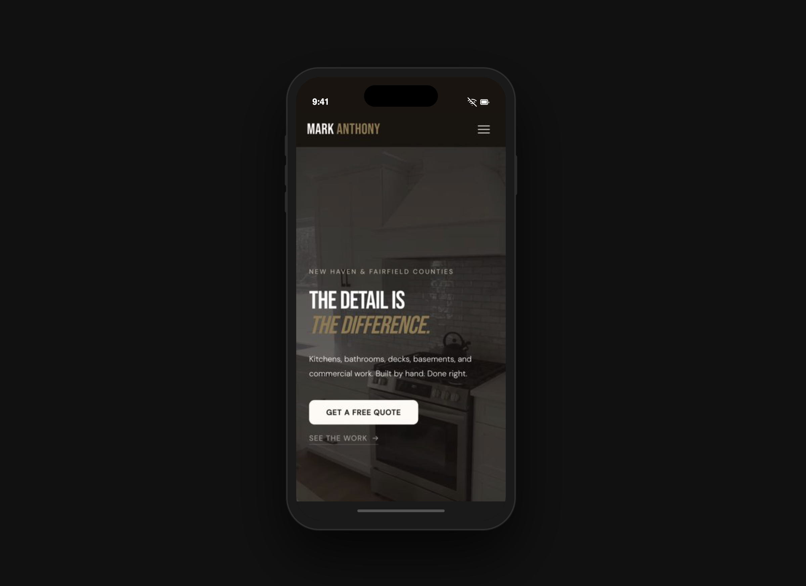

# Mark Anthony Home Improvement

**A brand identity and website concept for a Connecticut general contractor serving New Haven & Fairfield County.**  
Designed and developed by Michael Hnath — Brand & Growth Strategist at [THIS](https://github.com/MikeHnath).



🔗 **[Live demo →](https://mikehnath.github.io/MarkAnthony/)**

### Mobile Preview

> Scroll inside the phone to explore the full page.

<div align="center">
<table><tr><td align="center" style="background:#111;padding:40px;border-radius:12px;">


<!-- Home indicator -->
<div style="height:24px;background:#1a1a1a;border-radius:0 0 30px 30px;display:flex;align-items:center;justify-content:center;">
<div style="width:100px;height:4px;background:rgba(255,255,255,.2);border-radius:2px;"></div>
</div>

</div>

</td></tr></table>
</div>


---

## The Brief

Most small contractors in Connecticut do excellent work and have zero digital presence to show for it. They rely entirely on word of mouth, have no website, and lose bids to competitors with weaker work but better marketing. Mark Anthony Home Improvement is exactly that contractor — one-man crew, detail-obsessed, solid social following, no web presence.

This project answers a direct question:

> What does a trades brand look like when it's positioned, designed, and built to the same standard as the work it delivers?

---

## What's Built

A fully responsive, production-ready website across five sections:

- **Hero** — full-screen video background, animated headline, scroll reveal
- **Intake form** — centered lead capture with project type and timeline fields
- **About** — full-bleed two-column layout with sepia-treated project photography
- **Stats band** — Years / Projects / Counties on a terracotta accent row
- **Gallery** — auto-advancing slideshow with manual prev/next and dot navigation, 7 real project photos
- **Services** — responsive grid (3-col desktop → 2-col tablet → 1-col mobile)
- **Contact** — two-column layout with service area tags and full inquiry form

---

## Design Decisions

**Brand direction: Warm Editorial**  
Aged linen background (`#f2ede4`), terracotta accent (`#8b3a2a`), near-black ink. Positioned to resonate with Fairfield County homeowners and SMB clients — feels premium without feeling corporate.

**Typography**  
Fraunces (display) paired with DM Sans (body/UI). The Fraunces italic on "Anthony" in the logo splits the name into two visual weights, creating a subtle brand mark out of the wordmark itself.

**Photography**  
All gallery and section images are real project photos pulled directly from Mark's social accounts. No stock. Every bathroom, kitchen, and deck shown is actual work.

---

## Stack

```
HTML5 / CSS3 / Vanilla JS
Hosted via GitHub Pages
Fonts via Google Fonts (Fraunces, DM Sans)
```

No frameworks. No dependencies. Fast load, clean code.

---

## File Structure

```
MarkAnthony/
├── index.html
├── style.css
├── mobile.css
├── main.js
└── assets/
    ├── hero.mp4
    ├── precision-craftsmanship-mark-anthony.jpg
    ├── marble-tile-black-fixtures.jpg
    ├── granite-island-renovation.jpg
    ├── vanity-tile-detail.jpg
    ├── elevated-deck-new-haven-county.jpg
    └── ada-accessibility-ramp.jpg
```

---

## Context

Stonewater was the spark — a spec concept for the luxury outdoor living category built to open doors. Mark Anthony is the proof of concept — a real brand, a real contractor, a real pitch. Built under [THIS](https://github.com/MikeHnath), a boutique brand and growth consultancy serving SMBs across Fairfield County, CT.

---

*Built by Michael Hnath · [linkedin.com/in/michaelhnath](https://linkedin.com/in/michaelhnath)*
